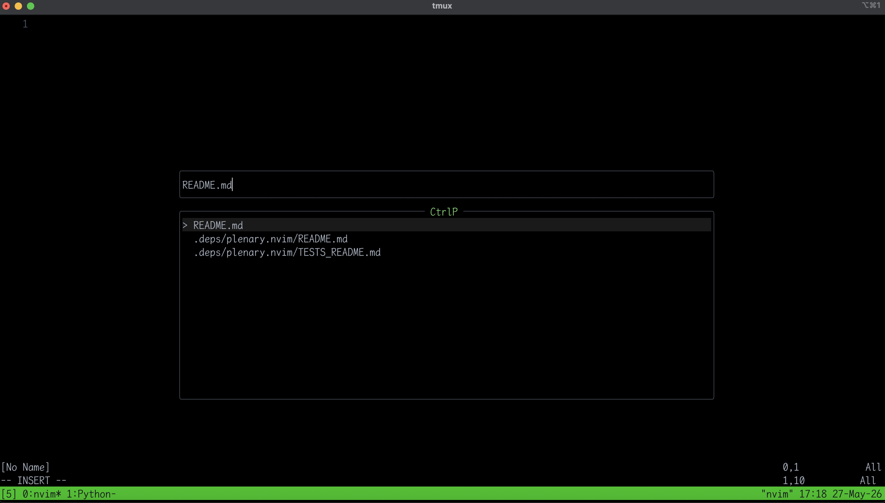

# ctrlp.nvim

> A fuzzy file finder for Neovim, written in pure Lua. Built because existing finders were either too heavy or didn't feel right — and because the original [ctrlp.vim](https://github.com/ctrlpvim/ctrlp.vim) deserved a modern successor.

## Why not just use ctrlp.vim?

[ctrlp.vim](https://github.com/ctrlpvim/ctrlp.vim) is a classic. It pioneered the "single `<C-p>` to rule them all" workflow in Vim. But it was written in Vimscript, and the Neovim ecosystem has moved on:

- **LuaJIT is fast**, Vimscript is a bottleneck — scanning large directories, sorting thousands of results, rendering a floating UI... all of this is painful in Vimscript and trivial in Lua
- **Floating windows** let us build a modern UI that doesn't fight the rest of the editor
- **Built-in LSP** and async APIs change what a "finder" can be

ctrlp.vim still works, but it's in maintenance mode. This project is a **spiritual successor** — not a fork, not a wrapper, but a ground-up rebuild that keeps the ctrlp soul (fast, minimal, keyboard-first) while speaking native Neovim.


## Install

```lua
-- lazy.nvim
{
  "r1cardohj/ctrlp.nvim",
  config = function()
    require("ctrlp").setup()
  end
}
```

Or symlink for local hacking:

```bash
cd ~/.config/nvim/lua && ln -s /path/to/ctrlp.nvim ./ctrlp.nvim
```

## Usage

| Key | Action |
|---|---|
| `<C-p>` or `:CtrlP` | Open file finder |
| Type | Filter files in real time |
| `<CR>` | Open selected file |
| `<C-n>` / `<C-p>` | Navigate down / up |
| `<Down>` / `<Up>` | Same as above |
| `<F5>` | Refresh cache and rescan directory |
| `<Esc>` / `<C-c>` | Close |

## Preview



## Setup

```lua
require("ctrlp").setup({
  max_files = 10000,
  use_cache = true,    -- keep scan results in memory for instant reopen
  show_hidden = false, -- exclude dotfiles/dot-directories (.git, .idea, ...)
  root_markers = {     -- project root detection: search upward from cwd
    ".git",
    ".hg",
    ".svn",
    "package.json",
    "go.mod",
    "Cargo.toml",
  },
  ignore_patterns = {
    "^%.git/",
    "^node_modules/",
    "^target/",
    "^dist/",
    "^build/",
  },
})
```

## Caching

This plugin uses a **semi-manual caching strategy** — the same philosophy as the original ctrlp.vim:

- The first `<C-p>` scans the directory tree (may take a moment on large projects)
- Subsequent openings in the same Neovim session are **instant** because the file list is kept in memory
- The cache does **not** watch the filesystem. If you create, delete, or rename files, press `<F5>` inside the finder window to purge the cache and rescan
- Or run `:CtrlPClearCache` from anywhere

**Why not auto-refresh?** Real-time directory monitoring (`inotify` / `FSEvents`) consumes kernel resources and adds cross-platform complexity. For a plugin that values simplicity, a manual refresh is a fair trade-off — you control when to pay the scanning cost.

If you prefer to disable caching entirely:

```lua
require("ctrlp").setup({ use_cache = false })
```

## Vision

This project aims to be what ctrlp.vim would have been if it were born in the Neovim era:

- **Phase 1 — solid foundation** ✅
  - [x] Fuzzy file finding with scoring
  - [x] Float window UI with real-time filtering
  - [x] Zero external dependencies
  - [x] Selection highlight
  - [x] Basic test coverage

- **Phase 2 — the ctrlp essentials**
  - [x] Cached file list (scan once, instant reopen)
  - [ ] `<C-d>` — copy selected file's directory into the prompt
  - [ ] `<C-y>` — create new file (and parent directories) from the prompt
  - [x] Project root detection (`.git`, `package.json`, `go.mod`, ...)
  - [ ] Buffer mode — switch between open buffers
  - [ ] MRU mode — reopen recently used files
  - [ ] Mixed mode — files + buffers + MRU in one list
  - [ ] `<C-f>` / `<C-b>` to cycle modes without closing the window
  - [ ] `<C-x>` / `<C-v>` / `<C-t>` to open in split / vsplit / tab

- **Phase 3 — polish**
  - [ ] Auto-refresh cache on file changes
  - [ ] Devicon support
  - [ ] Async scanning for massive directories
  - [ ] Custom actions & extensions

No plans for LSP grep, live_grep, or command palette — that's what telescope and fzf-lua are for. This plugin stays focused on **finding and opening files, buffers, and recent files**.

## Develop

```bash
# Run tests
make test

# Clean test dependencies
make clean
```

## License

MIT — do whatever you want.
